## Final project- PLP
## FRontend Url
https://yelpa.vercel.app/ 
## Backend URL
https://yelpa-nrkt.onrender.com/

# **Yelpa – Instant Emotional Release & Social Support Platform**


##live site: https://yelpa.vercel.app/ 

**Yelpa** is a social media platform designed to help users release stress, vent emotions, and get support from verified listeners or empathetic peers. Users can create posts, "Yelp" for emotional release, chat in real-time, and access an emergency SOS feature for immediate help.

---

## **Problem Statement**

Modern social media platforms don’t provide **safe, immediate emotional support**. Many users struggle to express stress or frustration in a healthy way, and professional help isn’t always accessible instantly. Yelpa solves this problem by combining social interaction with **instant emotional release** and verified listener support.

---

## **Key Features**

---

### **1. Social Interaction**

#### **Feed Page**

View posts and interactions from your connections. Stay updated on community activity.

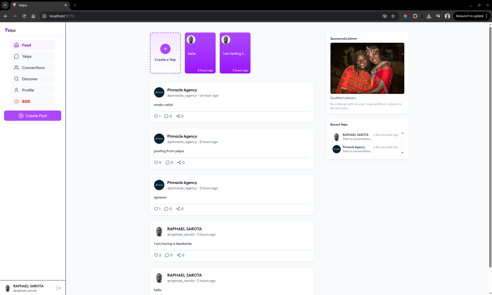

#### **Discover Page**

Search and discover new users to follow, connect, and engage with.

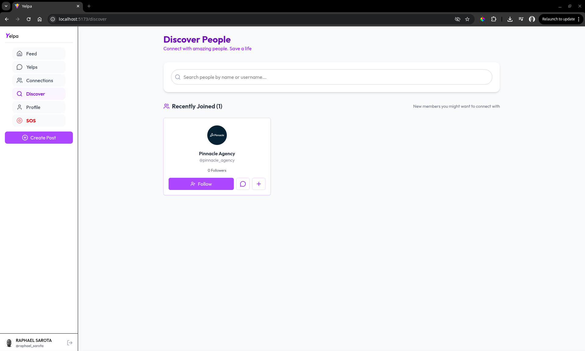

#### **Connections Page**

Manage friends and followers, see suggested connections, and build your network.

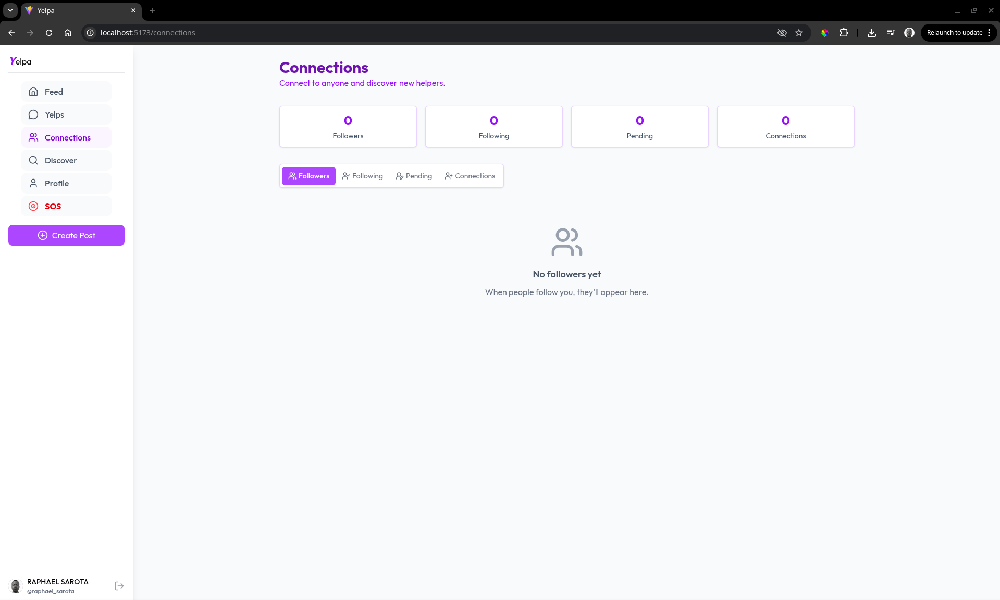

#### **Profile Page**

View and edit personal information, posts, and stories.

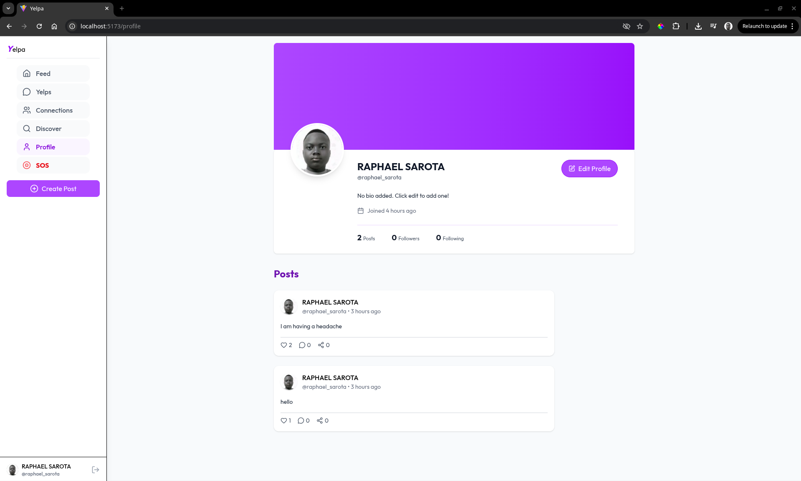

#### **Story Creation & Viewing**

Share temporary stories and view stories from your network.


---

### **2. Support Tools**

#### **Yelp Creation**

Instantly create a "Yelp" to vent emotions or stress. Can be sent to verified listeners or shared anonymously.

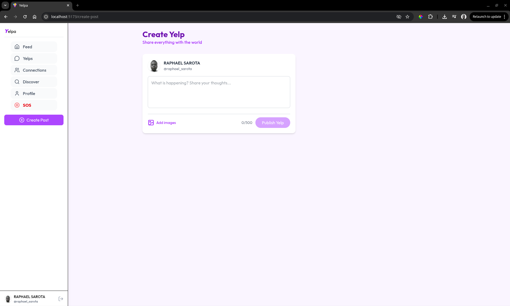

#### **View Yelps**

Browse yelps from others, respond, or offer support.

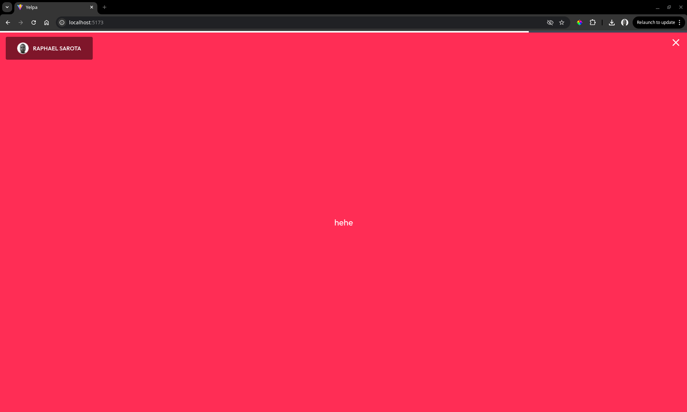

#### **Real-Time Messaging**

Chat directly with supporters or friends in real-time.

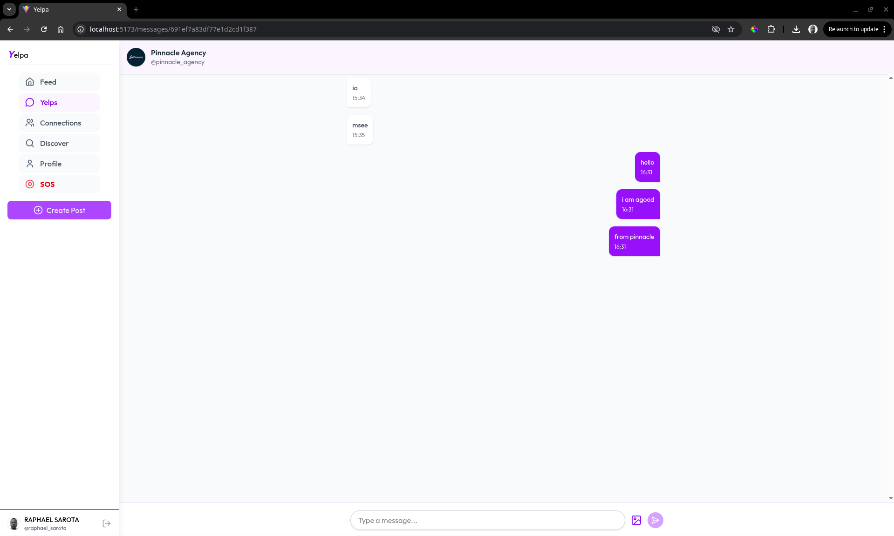

---

### **3. Safety & Emergency Features**

#### **SOS / Emergency Page**

Quick-access distress feature connecting users to professional support.

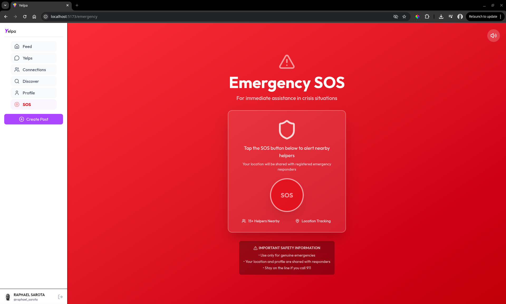

#### **Verified Listener Badges**

Identify trusted, verified supporters in the community.

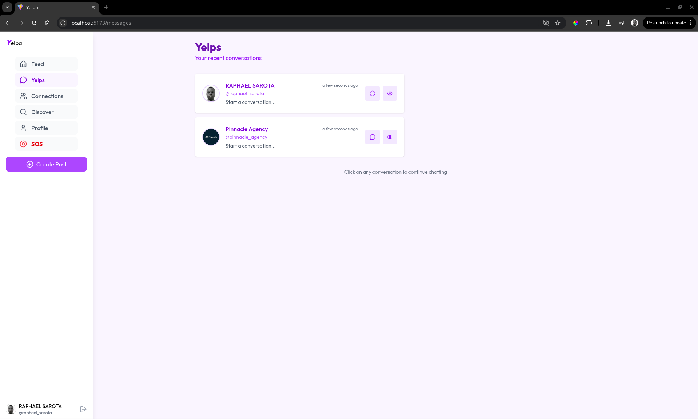

---

### **4. User Experience**

#### **Edit Profile & Manage Account**

Update personal info, cover photos, and profile pictures easily.

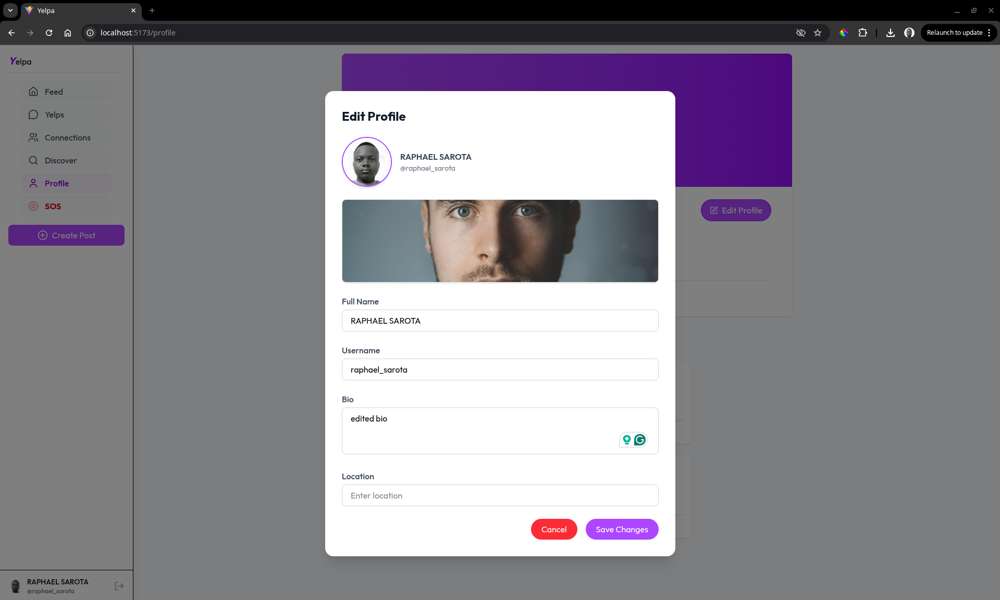

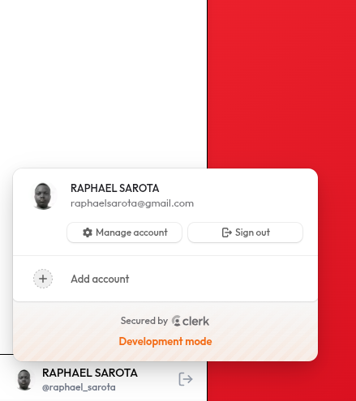

#### **Responsive Mobile Layout**

Smooth user experience on mobile devices.

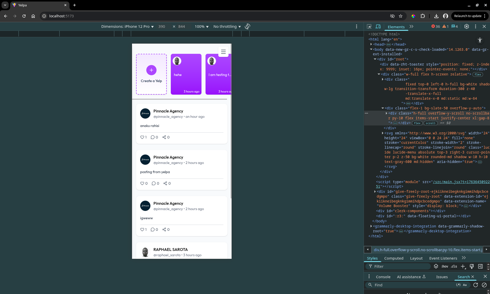

#### **Clean UI & Modern Design**

User-friendly interface with intuitive navigation and transitions.


---

## **Project Structure**

**Client (Frontend)** – React (Vite, Tailwind CSS)

```
──(sarota㉿kali)-[~/…/PLP/MERN/yelpa/client]
└─$ tree -I "node_modules"

.
├── eslint.config.js
├── index.html
├── package.json
├── package-lock.json
├── public
│   └── vite.svg
├── README.md
├── src
│   ├── App.jsx
│   ├── assets
│   │   ├── assets.js
│   │   ├── bgImage.png
│   │   ├── chattingpage.png
│   │   ├── connectionspage.png
│   │   ├── createyelppage.png
│   │   ├── discoverpage.png
│   │   ├── editprofilepage.png
│   │   ├── favicon.svg
│   │   ├── feedpage.png
│   │   ├── group_users.jpg
│   │   ├── group_users.png
│   │   ├── logo.svg
│   │   ├── manageaccount.png
│   │   ├── mobileview.png
│   │   ├── profilepage.png
│   │   ├── sample_cover.jpg
│   │   ├── sample_profile.jpg
│   │   ├── SOSpage.png
│   │   ├── sponsored_img.jpg
│   │   ├── viewyelps.png
│   │   └── yelpspage.png
│   ├── components
│   │   ├── Loader.jsx
│   │   ├── Logo.jsx
│   │   ├── MenuItems.jsx
│   │   ├── PostCard.jsx
│   │   ├── ProfileModal.jsx
│   │   ├── RecentMessages.jsx
│   │   ├── Sidebar.jsx
│   │   ├── StoriesBar.jsx
│   │   ├── StoryModel.jsx
│   │   ├── StoryViewer.jsx
│   │   ├── UserCard.jsx
│   │   └── UserProfileInfo.jsx
│   ├── index.css
│   ├── main.jsx
│   ├── pages
│   │   ├── Chatbox.jsx
│   │   ├── Connection.jsx
│   │   ├── CreatePost.jsx
│   │   ├── Discover.jsx
│   │   ├── Emergency.jsx
│   │   ├── Feed.jsx
│   │   ├── Layout.jsx
│   │   ├── Login.jsx
│   │   ├── Messages.jsx
│   │   └── Profile.jsx
│   └── services
│       ├── api.js
│       ├── authService.js
│       ├── connectionService.js
│       ├── index.js
│       ├── messageService.js
│       ├── postService.js
│       ├── storyService.js
│       └── userService.js
└── vite.config.js

7 directories, 61 files
```

**Server (Backend)** – Node.js, Express, MongoDB

```
──(sarota㉿kali)-[~/…/PLP/MERN/yelpa/server]
└─$ tree -I "node_modules"

.
├── config
│   └── db.js
├── controllers
│   ├── connectionController.js
│   ├── messageController.js
│   ├── postController.js
│   ├── storyController.js
│   └── userController.js
├── inngest
│   └── index.js
├── middlewares
│   └── auth.js
├── models
│   ├── Message.js
│   ├── Post.js
│   ├── Story.js
│   └── User.js
├── package.json
├── package-lock.json
├── routes
│   ├── auth.js
│   ├── connections.js
│   ├── messages.js
│   ├── posts.js
│   ├── stories.js
│   └── users.js
└── server.js

7 directories, 21 files
```

---

## **Getting Started**

1. Clone the repository:

```bash
git clone https://github.com/Topher254/yelpa.git
```

2. Install dependencies for client and server:

```bash
cd client && npm install
cd ../server && npm install
```

3. Run the development servers:

```bash
cd client && npm run dev
cd ../server && npm run dev
```

---

# Screenshots

## Feed


## Discover


## Connections


## Chat


## Profile


## Mobile View


## Create Yelp


## View Yelps


## Yelps Page


## Edit Profile


## Manage Account


## SOS


## **Contact**

* **Developer:** Raphael Sarota
* **Email:** [raphaelsarota@gmail.com](mailto:raphaelsarota@gmail.com)
* **LinkedIn:** [linkedin.com/in/sarota-raphael](https://www.linkedin.com/in/sarota-raphael)
* **GitHub:** [Topher254](https://github.com/Topher254)

---


